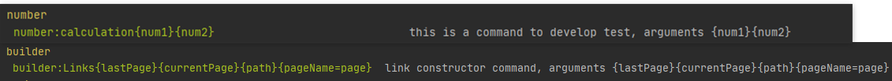

#Prueba de commands
<p>
    <b>Artisan,</b> es nuestro asistente cuando estamos trabajando o creando un proyecto.<br>
    Aquí podemos crear comandos personalizados. <br><br>
    Con dos sencillos ejemplos podremos entender como crear comandos con Artisan
</p>

###Creado command personalizado

Para crear un nuevo comando de Artisan solo debemos ejecutar la siguiente instrucción en nuestra terminal:


```
    php artisan make:command BuilderLinksTest
```

Este comando creará una nueva clase en el directorio *app/Console/Commands* llamada BuilderLinksTest. 
Puedes además enviar la opción  *--command* con la cual podemos especificar cómo puede ser llamado el comando desde la terminal.

El comando que hemos creado, lo encotraremos en **app/Console/Commands/BuilderLinksTest.php** y al abrir el fichero
colocaremos el nombre del comando, argumentos y su descripción

<hr>

### 1º ejemplo de comando BuilderLinksTest

```
    /**
     * The name and signature of the console command.
     *
     * @var string
     */
    protected $signature = 'builder:Links{lastPage}{currentPage}{path}{pageName=page}';

    /**
     * The console command description.
     *
     * @var string
     */
    protected $description = 'link constructor command';
```

_Los comandos en Laravel pueden tener como entradas de datos: opciones y/o argumentos. Una opción 
de un comando puede cambiar el comportamiento de un comando y se expresa con el prefijo  --  , mientras 
que un argumento es un valor que puede requerir un comando para trabajar sobre él._

Por último, vamos a definir la lógica de nuestro comando en el método **handle** de esta forma:

````
    use App\links\PageLinks;

 public function handle()
    {
        $argu = (object) $this->arguments();
        $builderlinks = new PageLinks($argu->lastPage, $argu->currentPage,$argu->path,$argu->pageName);

        dd($builderlinks->alllinks());
        
        return 0;
    }
````

El método argument nos ayuda a recuperar un argumento pasado al invocar el 
comando (de la misma manera existe el método option si quieres recuperar una opción).  Por
otro lado, el método info nos permite enviar un mensaje a la consola, 
también tenemos disponible el método error para enviar un mensaje de 
advertencia o error.

Creamos la clase **PageLinks** para realizar las pruebas correspondientes

[Carpeta PageLinks](app/links "Clase Pagelinks")

<hr>

### 2º ejemplo de comando Operations

Igual que en el primer ejemplo, creamos el comando Operations, le damos un nombre 
para ejecutarlo y los argumentos.

````
/**
     * The name and signature of the console command.
     *
     * @var string
     */
    protected $signature = 'number:calculation {num1}{num2}';


    /**
     * The console command description.
     *
     * @var string
     */
    protected $description = 'this is a command to develop test';
````

````
    use App\partial\operations\Advanced_operations;    
    use Carbon\Carbon;

 public function handle()
    {
        $numbers = (object) $this->arguments();
        $inicio = Carbon::now();

        sleep(5);

        $oper = new Advanced_operations($numbers->num1,$numbers->num2,$inicio);
        $oper->operations_basic();
        $oper->hypotenuse();
        $oper->perimeter();

        dd($oper->operations_basic());
        return 0;
    }
````
Creamos la clase **Advanced_operations** para realizar las pruebas correspondientes

[Carpeta Advanced_operations](app/partial/operations "Clase Advanced_operations")

<hr>

Con esto ya tenemos nuestros comandos funcionando. Al ejecutar 
*php artisan* podemos verlo incluido en el listado.

````
    php artisan
````


